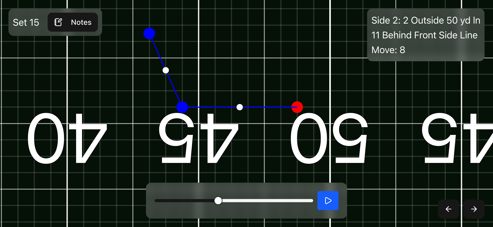
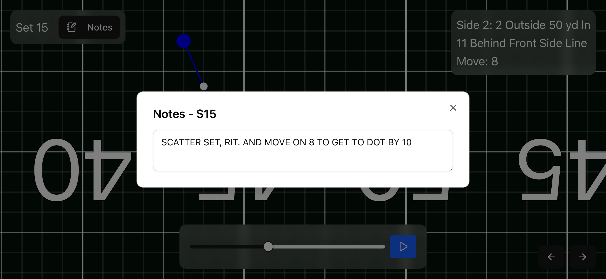
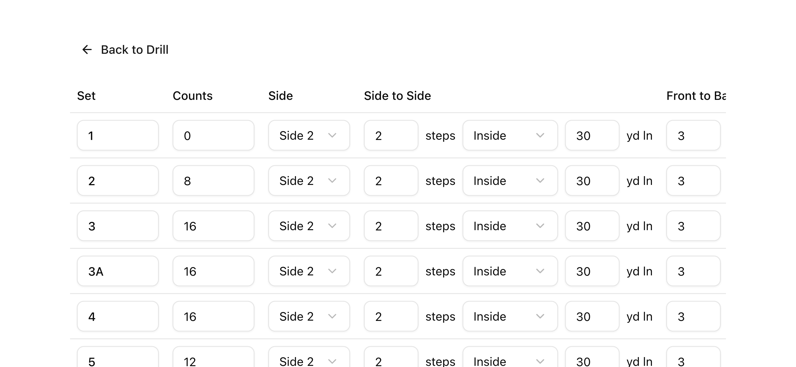
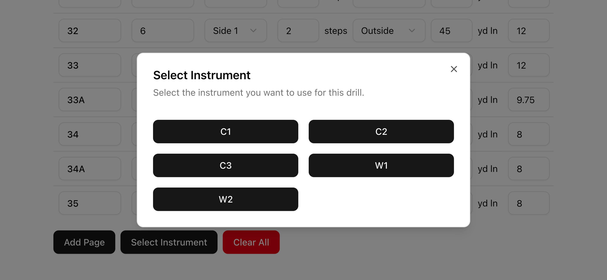

# Drill Utils

> [!NOTE]  
> Drill Utils has been released! Access it at this link: https://drill25.alaninnovates.com

Drill Utils is a visualizer for marching band drill, which is essentially just a series of formations that a marching band performs on a field. You can add your own drill or select from some pre-made ones (I made these for my fellow clarinet section members!).

## Features

- **Drill Viewing**: View your drill with position, midsets, and counts (holding/moving). Zoom and pan as well!
- **Notes**: Add notes to specific counts for reference (like if your director gives you particular choreo)
- **Detailed Field Grid**: I spent a good chunk of time making sure that the field matches up 1-1 with a real-life high school football field. Who knows, maybe I'll add more field dimensions in the future.
- **Optimized for Mobile**: My fellow section members and I have been using this *a lot* on their phones, and on the field. It makes it a breeze to learn new drill, and you'll always be faster than the rest of the people to find your next dot.

Some screenshots!
<table>
    <tr>
        <td>
            
            
Drill View - midsets in white, current dot in red

        </td>
        <td>
            
            
Notes view, free to edit and automatically saves

        </td>
    </tr>
    <tr>
        <td>
            
            
View all/manage dots

        </td>
        <td>
            
            
Select Instrument

        </td>
    </tr>
</table>

To get started, go to https://drill25.alaninnovates.com and choose some drill to view! Personally, I'd go with C2... maybe because that's my actual drill number this year 👀